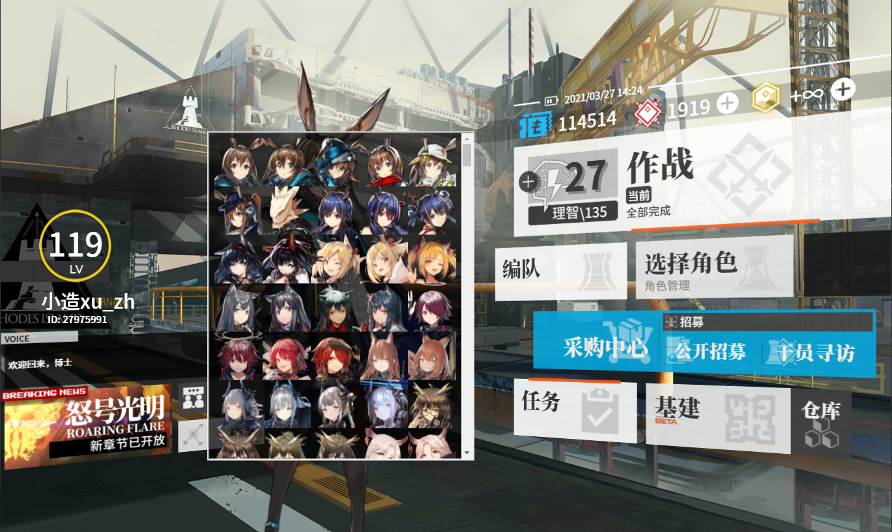

# Arknights UI Remastered：H5 + CSS + Vue 复刻明日方舟主界面

衍生自[mashirozx/arknights-ui](https://github.com/mashirozx/arknights-ui)

## 小造BB
作为一个h5、css、javascript外加vue.js的四重初学者（要学的怎么越来越多了啊喂）和一个学生党，我因为对明日方舟的厨力开始尝试更新此项目。

如果您对于我有任何建议（包括使用Github的方式、写代码的格式、命名规范等等）请不吝赐教，谢谢。

## 目前实现的功能
- 使用空格键控制BGM播放/暂停，上/下键控制音量，左/右键播放上下首
- “情报”：作者信息
    * 
- “好友”/“购买源石、合成玉”：主设置界面，可设置用户昵称、等级、ID、理智上限、三种代币数额、作战进度、对话。
    * 
- “作战”：BGM播放/暂停
    * 
- “理智”：BGM设置界面
    * 
- “干员”：切换角色立绘界面
    * 
- “编队”：调整干员立绘位置
    * 

## Change log
- 2021/04/01 什么都没有更新？什么？你说按`F12`在控制台输入`HappyAprilFoolsDay(1)`有奇效？才没有呢！
- 2021/03/27 V2.1.1 更新`update_bgmlist.py`，修改部分数据结构
- 2021/03/25 增加`update_bgmlist.py`用于自动从网易云获取BGM，修复bgm相关bug
- 2021/03/05 V2.1 增加立绘缩放的功能
- 2021/03/05 V2.0 Vue重写基本完成，增加`update_characters.py`用于更新立绘
- 2021/03/04 使用json存储BGM和立绘数据，用Vue重写`set_characters.html`
- 2021/02/03 V2.0beta
- 2021/02/02 开始尝试用vue重写部分功能，大幅度简化代码，并将vue分支作为默认分支。原始版本（最后于2020/08/28更新）请见[master分支](https://github.com/ngc7331/arknights-ui-remastered/tree/master)
- 此前的更新请查看[commits](https://github.com/ngc7331/arknights-ui-remastered/commits/master)

## TODO
- 美化界面
- 增加按钮动效
- 整合剧情回放、抽卡模拟等功能？
- ...
- 要学的还很多啊

## DEMO
Github page：<https://ngc7331.github.io/arknights-ui-remastered/>

国内请尝试Gitee：<https://xu_zh.gitee.io/arknights-ui-remastered/>

## 版权相关
界面贴图素材都是游戏逆向出来的，仅供学习使用，请勿商用。

## License
© [Mashiro](https://github.com/mashirozx/), [xu_zh](https://github.com/ngc7331/), Released under the [MIT](https://github.com/mashirozx/arknights-ui/blob/master/LICENSE) License.
